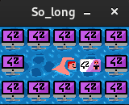
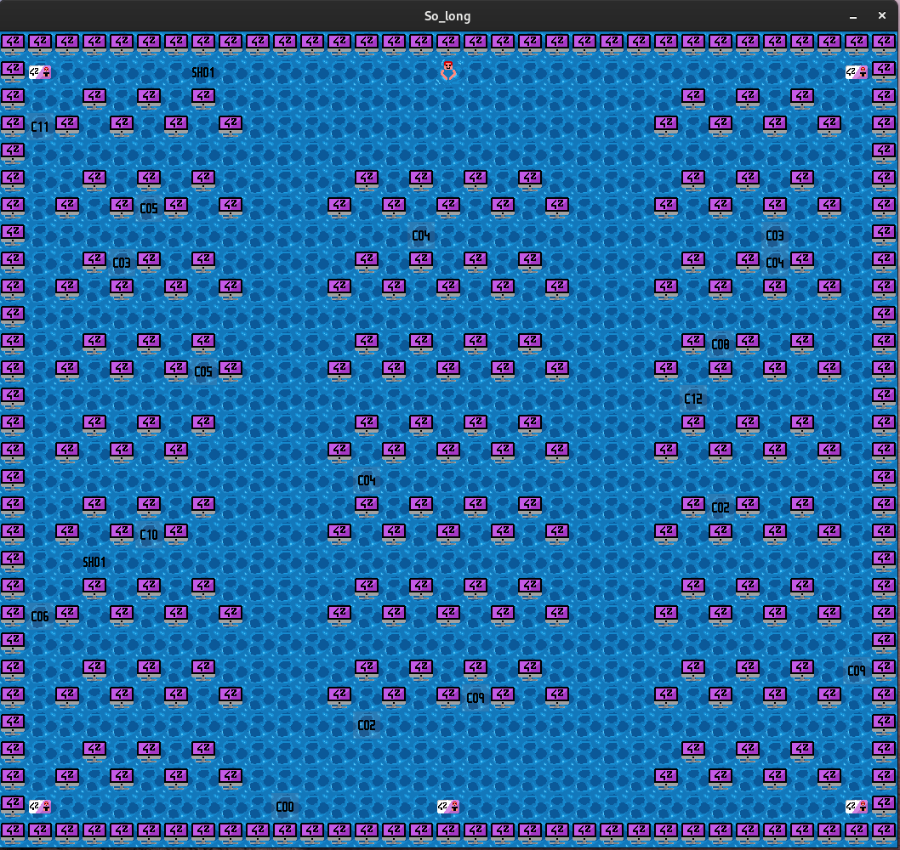

# so_long

This project was a very small 2D game. It's a PacMan like using the 42's graphical library : MinilibX.

I tried to create my own design and I used my experience in 42's exam : the Piscine. I'ts a little swimmer that has to finish some exercises to get into 42.

## Some screenshots

